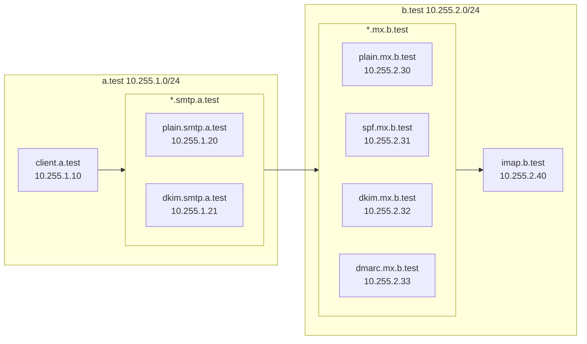

※ main リポジトリは随時更新を行っており、技術書典で発行した内容と異なっています。 [v1ブランチ](https://github.com/KasuyaMofu/smtpbook/tree/v1)を参照してください

# SMTP本

## 初期設定

### ネットワークの指定

compose.yaml は、 `/16` のネットワークを作成します。対象のネットワークを、 `.env` ファイルで指定してください。デフォルトでは、 `10.255.0.0/16` を示す `NETWORK=10.255` が設定されています。

尚、 `.env` ファイルを更新した場合は、後述の `make build` を再度行ってください。

### イメージのビルド

イメージの作成のため、一度だけ、以下のコマンドを実行してください。

```
make build
```

## 起動方法

以下のコマンドを実行すると、全てのコンテナが起動します。

```
make up
```

## ネットワーク構成

make up を実行すると、以下の図のネットワークが構成されます。この環境を元に、 a.test から b.test へのメール送信を行います。



### a.test


サーバ名 | IP | 備考
-: | :- | :-
client.a.test     | .1.10  | メール送信テスト用のスクリプトが配置されています。
plain.smtp.a.test | .1.20 | 署名を行わないSMTPサーバ。
dkim.smtp.a.test  | .1.21 | DKIM署名を行うSMTPサーバ。セレクタは `smtpbook`。

また、以下のTXTレコードを設定しています。

ドメイン | レコード 
-: | :-
a.test                     |  `"v=spf1 ip4:_NETWORK.1.30/31 -all"` 
fail.a.test                |  `"v=spf1 ip4:_NETWORK.255.30/31 -all"` 
smtpbook._domainkey.a.test |  `"v=DKIM1; k=rsa; " "p=MIIBIjAN(省略)QIDAQAB"`
_dmarc.a.test              |  `"v=DMARC1; p=quarantine; pct=100"`


### b.test

サーバ名 | IP | 備考
-: | :- | :-
plain.mx.b.test  | .1.30 | 検証を行わない
spf.mx.b.test    | .1.31 | SPFの検証を行う
dkim.mx.b.test   | .1.32 | DKIM署名の検証を行う
dmarc.mx.b.test  | .1.33 | SPF/DKIM/DMARCの検証を行う
imap.b.test      | .1.40 | *.mx.b.test へのメールは、全てこのサーバにリレーされる

### その他

サーバ名 | IP | 備考
-: | :- | :-
dns       | .0.254 | `*.test` の全てのDNSレコードを保持
logserver | .0.253 | syslog は全てこのサーバに転送され、 `docker compose` もこの結果を参照します

## 実行例

以下のようなコマンドを実行すると、それぞれのメール送信の様子を見ることができます。

```bash
make build
make up
make scenario4-1/send
make view
```

### 実行ログの例

`make scenario[1-4][1-4]/send` を実行すると、 `a-client` コンテナに設置されている `/example/send.sh` が実行され、指定したFrom、Toを元に、SMTPサーバに `telnet` コマンドでSMTP通信を行う様子が確認できます。 

```
$ make scenario4-1/send
docker compose exec a-client /send.sh scenario4-1 user1@pass.dkim.a.test    user1@dmarc.b.test   dkim.smtp.a.test
# telnet dkim.smtp.a.test 25
--------------------------
Trying 10.255.1.21...
Connected to dkim.smtp.a.test.
Escape character is '^]'.
220 dkim.smtp.a.test ESMTP Postfix
HELO pass.dkim.a.test
250 dkim.smtp.a.test
MAIL FROM: user1@pass.dkim.a.test
250 2.1.0 Ok
RCPT TO:   user1@dmarc.b.test
250 2.1.5 Ok
DATA
354 End data with <CR><LF>.<CR><LF>
Message-ID: <20260112181516.7040@pass.dkim.a.test>
Date: Mon, 12 Jan 2026 18:15:17 +0900
From: user1@pass.dkim.a.test
To:   user1@dmarc.b.test
Subject: scenario4-1 (mail from user1@pass.dkim.a.test)

Hello user1@dmarc.b.test!
.
250 2.0.0 Ok: queued as ADCF92010719
QUIT
221 2.0.0 Bye
Connection closed by foreign host.
--------------------------
```

`make view` を実行すると、 `user1@b.test` へ送信された最新のメールを確認することができます。

※ POP3 接続や IMAP 接続は行わないため、表示した対象のメールは `cur/` への移動は行われません。

```
$ make view
docker compose exec b-imap /view.sh user1
--------------------------
Return-Path: <user1@pass.dkim.a.test>
Received: from dmarc.mx.b.test (dmarc.mx.b.test [10.255.2.33])
	by imap.b.test (Postfix) with ESMTP id BB8AA2010728
	for <user1@dmarc.b.test>; Mon, 12 Jan 2026 18:15:17 +0900 (JST)
Received: from dkim.smtp.a.test (dkim.smtp.a.test [10.255.1.21])
	by dmarc.mx.b.test (Postfix) with ESMTP id A867D2010721
	for <user1@dmarc.b.test>; Mon, 12 Jan 2026 18:15:17 +0900 (JST)
Authentication-Results: dmarc.mx.b.test;
	dkim=pass header.d=pass.dkim.a.test header.s=smtpbook header.b="DRIE/hB5";
	spf=pass (dmarc.mx.b.test: domain of user1@pass.dkim.a.test designates 10.255.1.21 as permitted sender) smtp.mailfrom=user1@pass.dkim.a.test;
	dmarc=pass (policy=quarantine) header.from=a.test
Received: from pass.dkim.a.test (client.a.test [10.255.1.10])
	by dkim.smtp.a.test (Postfix) with SMTP id ADCF92010719
	for <user1@dmarc.b.test>; Mon, 12 Jan 2026 18:15:16 +0900 (JST)
DKIM-Signature: v=1; a=rsa-sha256; c=relaxed/relaxed; d=pass.dkim.a.test;
	s=smtpbook; t=1768209317;
	h=from:from:reply-to:subject:subject:date:date:message-id:message-id:
	 to:to:cc; bh=4O5lFigIhxLU8If/5QjKchggSnc7Yxld80E41+l39XE=;
	b=DRIE/hB5eGRS6bXhXH0ZKqpB6HYdn1Wc+dmMwB4aVv1FrHMtyYyzDA9yzz3hvAuUa8a7uW
	1RI3IlEf+3hRQF6iMPHDdNKnq60J0BlonxW2SycsX7PVqc9yz2veSfiPc4FXsknFtc2BbL
	0Lh4Aj4m4/pA4QqGIhmIME8U59FOnXl/9AEvqzfAsvNQZGbrDXQDQHpl9DgVltMiWjZSP1
	0UsSR0sAP1CAiSToKiG5seLnT1N/dXwpVOhcNt4tQ9CjoKKeEJZG3xhmYDOluPWml98iOe
	R7rfi6f38+fY2kbdZfyS2eZv9qPxad6geW7pp4phrZUwhAWd5+mBmCHjYfiVCg==
Message-ID: <20260112181516.7040@pass.dkim.a.test>
Date: Mon, 12 Jan 2026 18:15:17 +0900
From: user1@pass.dkim.a.test
To:   user1@dmarc.b.test
Subject: scenario4-1 (mail from user1@pass.dkim.a.test)

Hello user1@dmarc.b.test!
--------------------------
```

## 補足: docker compose の出力について

`make scenario[1-9]/send` を実行すると、 `docker compose` の標準出力からDNSの問い合わせやpostfixのログを確認することができます。（※例示のグは順番を整形済み）

メールのヘッダーだけでなく、DNSへの問い合わせ、postfixのログから、さらに理解を深められるようにできています。

```
logserver     | 2026-01-12T18:15:16.388640+09:00 5a764aa86bf3             recursor:                NOERROR   (   client.a.test) dkim.smtp.a.test.         	   60	IN	   A	10.255.1.21
logserver     | 2026-01-12T18:15:16.388716+09:00 5a764aa86bf3             recursor:                NOERROR   (   client.a.test) dkim.smtp.a.test.         	     	IN	AAAA
logserver     | 2026-01-12T18:15:16.394413+09:00 5a764aa86bf3             recursor:                NOERROR   (dkim.smtp.a.test) 10.1.255.10.in-addr.arpa. 	86400	IN	 PTR	client.a.test.
logserver     | 2026-01-12T18:15:16.394699+09:00 dkim.smtp.a.test         postfix/smtpd[125]:      connect from client.a.test[10.255.1.10]
logserver     | 2026-01-12T18:15:16.394747+09:00 5a764aa86bf3             recursor:                NOERROR   (dkim.smtp.a.test) client.a.test.            	   60	IN	   A	10.255.1.10
logserver     | 2026-01-12T18:15:16.394954+09:00 dkim.smtp.a.test         milter:                  {"ip":"10.255.1.10","mode":"S","data":"220 dkim.smtp.a.test ESMTP"}
logserver     | 2026-01-12T18:15:16.394954+09:00 dkim.smtp.a.test         milter:                  {"ip":"10.255.1.10","mode":"R","data":"CONNECT from client.a.test [10.255.1.10]"}
logserver     | 2026-01-12T18:15:16.395187+09:00 5a764aa86bf3             recursor:                NOERROR   (dkim.smtp.a.test) localhost.                	86400	IN	   A	127.0.0.1
logserver     | 2026-01-12T18:15:16.492781+09:00 dkim.smtp.a.test         milter:                  {"ip":"10.255.1.10","mode":"R","data":"EHLO pass.dkim.a.test"}
logserver     | 2026-01-12T18:15:16.492781+09:00 dkim.smtp.a.test         milter:                  {"ip":"10.255.1.10","mode":"S","data":"250 dkim.smtp.a.test"}
logserver     | 2026-01-12T18:15:16.601907+09:00 dkim.smtp.a.test         milter:                  {"ip":"10.255.1.10","mode":"R","data":"MAIL FROM:<user1@pass.dkim.a.test>"}
logserver     | 2026-01-12T18:15:16.601907+09:00 dkim.smtp.a.test         milter:                  {"ip":"10.255.1.10","mode":"S","data":"250 2.1.0 Ok"}
logserver     | 2026-01-12T18:15:16.704184+09:00 dkim.smtp.a.test         milter:                  {"ip":"10.255.1.10","mode":"R","data":"RCPT TO:<user1@dmarc.b.test>"}
logserver     | 2026-01-12T18:15:16.704184+09:00 dkim.smtp.a.test         milter:                  {"ip":"10.255.1.10","mode":"S","data":"250 2.1.5 Ok"}
logserver     | 2026-01-12T18:15:16.712527+09:00 dkim.smtp.a.test         postfix/smtpd[125]:      ADCF92010719: client=client.a.test[10.255.1.10]
logserver     | 2026-01-12T18:15:17.642881+09:00 dkim.smtp.a.test         postfix/cleanup[128]:    ADCF92010719: message-id=<20260112181516.7040@pass.dkim.a.test>
logserver     | 2026-01-12T18:15:17.643678+09:00 dkim.smtp.a.test         milter:                  {"ip":"10.255.1.10","mode":"R","data":"HEADER Message-ID: <20260112181516.7040@pass.dkim.a.test>"}
logserver     | 2026-01-12T18:15:17.643791+09:00 dkim.smtp.a.test         milter:                  {"ip":"10.255.1.10","mode":"R","data":"HEADER Date: Mon, 12 Jan 2026 18:15:17 +0900"}
logserver     | 2026-01-12T18:15:17.643872+09:00 dkim.smtp.a.test         milter:                  {"ip":"10.255.1.10","mode":"R","data":"HEADER From: user1@pass.dkim.a.test"}
logserver     | 2026-01-12T18:15:17.643998+09:00 dkim.smtp.a.test         milter:                  {"ip":"10.255.1.10","mode":"R","data":"HEADER To:   user1@dmarc.b.test"}
logserver     | 2026-01-12T18:15:17.644133+09:00 dkim.smtp.a.test         milter:                  {"ip":"10.255.1.10","mode":"R","data":"HEADER Subject: scenario4-1 (mail from user1@pass.dkim.a.test)"}
logserver     | 2026-01-12T18:15:17.644256+09:00 dkim.smtp.a.test         milter:                  {"ip":"10.255.1.10","mode":"R","data":"DATA"}
logserver     | 2026-01-12T18:15:17.644256+09:00 dkim.smtp.a.test         milter:                  {"ip":"10.255.1.10","mode":"S","data":"354 End data with <CR><LF>.<CR><LF>"}
logserver     | 2026-01-12T18:15:17.644437+09:00 dkim.smtp.a.test         milter:                  {"ip":"10.255.1.10","mode":"R","data":"."}
logserver     | 2026-01-12T18:15:17.644437+09:00 dkim.smtp.a.test         milter:                  {"ip":"10.255.1.10","mode":"S","data":"250 2.0.0 Ok: queued"}
logserver     | 2026-01-12T18:15:17.662804+09:00 dkim.smtp.a.test         postfix/qmgr[123]:       ADCF92010719: from=<user1@pass.dkim.a.test>, size=454, nrcpt=1 (queue active)
logserver     | 2026-01-12T18:15:17.676825+09:00 5a764aa86bf3             recursor:                NOERROR   (dkim.smtp.a.test) dmarc.b.test.             	   60	IN	  MX	10 dmarc.mx.b.test.
logserver     | 2026-01-12T18:15:17.677393+09:00 5a764aa86bf3             recursor:                NOERROR   (dkim.smtp.a.test) dmarc.mx.b.test.          	   60	IN	   A	10.255.2.33
logserver     | 2026-01-12T18:15:17.683813+09:00 5a764aa86bf3             recursor:                NOERROR   ( dmarc.mx.b.test) 21.1.255.10.in-addr.arpa. 	86400	IN	 PTR	dkim.smtp.a.test.
logserver     | 2026-01-12T18:15:17.683990+09:00 dmarc.mx.b.test          postfix/smtpd[126]:      connect from dkim.smtp.a.test[10.255.1.21]
logserver     | 2026-01-12T18:15:17.684060+09:00 5a764aa86bf3             recursor:                NOERROR   ( dmarc.mx.b.test) dkim.smtp.a.test.         	   59	IN	   A	10.255.1.21
logserver     | 2026-01-12T18:15:17.684344+09:00 dmarc.mx.b.test          milter:                  {"ip":"10.255.1.21","mode":"S","data":"220 dmarc.mx.b.test ESMTP"}
logserver     | 2026-01-12T18:15:17.684344+09:00 dmarc.mx.b.test          milter:                  {"ip":"10.255.1.21","mode":"R","data":"CONNECT from dkim.smtp.a.test [10.255.1.21]"}
logserver     | 2026-01-12T18:15:17.684569+09:00 5a764aa86bf3             recursor:                NOERROR   ( dmarc.mx.b.test) localhost.                	86400	IN	   A	127.0.0.1
logserver     | 2026-01-12T18:15:17.684766+09:00 dmarc.mx.b.test          milter:                  {"ip":"10.255.1.21","mode":"R","data":"EHLO dkim.smtp.a.test"}
logserver     | 2026-01-12T18:15:17.684766+09:00 dmarc.mx.b.test          milter:                  {"ip":"10.255.1.21","mode":"S","data":"250 dmarc.mx.b.test"}
logserver     | 2026-01-12T18:15:17.686902+09:00 dmarc.mx.b.test          milter:                  {"ip":"10.255.1.21","mode":"R","data":"MAIL FROM:<user1@pass.dkim.a.test>"}
logserver     | 2026-01-12T18:15:17.686902+09:00 dmarc.mx.b.test          milter:                  {"ip":"10.255.1.21","mode":"S","data":"250 2.1.0 Ok"}
logserver     | 2026-01-12T18:15:17.687073+09:00 dmarc.mx.b.test          milter:                  {"ip":"10.255.1.21","mode":"R","data":"RCPT TO:<user1@dmarc.b.test>"}
logserver     | 2026-01-12T18:15:17.687073+09:00 dmarc.mx.b.test          milter:                  {"ip":"10.255.1.21","mode":"S","data":"250 2.1.5 Ok"}
logserver     | 2026-01-12T18:15:17.689927+09:00 dmarc.mx.b.test          postfix/smtpd[126]:      A867D2010721: client=dkim.smtp.a.test[10.255.1.21]
logserver     | 2026-01-12T18:15:17.690435+09:00 dmarc.mx.b.test          postfix/cleanup[129]:    A867D2010721: message-id=<20260112181516.7040@pass.dkim.a.test>
logserver     | 2026-01-12T18:15:17.690561+09:00 dmarc.mx.b.test          milter:                  {"ip":"10.255.1.21","mode":"R","data":"HEADER Received: from pass.dkim.a.test (client.a.test [10.255.1.10])\n\tby dkim.smtp.a.test (Postfix) with SMTP id ADCF92010719\n\tfor <user1@dmarc.b.test>; Mon, 12 Jan 2026 18:15:16 +0900 (JST)"}
logserver     | 2026-01-12T18:15:17.690623+09:00 dmarc.mx.b.test          milter:                  {"ip":"10.255.1.21","mode":"R","data":"HEADER DKIM-Signature: v=1; a=rsa-sha256; c=relaxed/relaxed; d=pass.dkim.a.test;\n\ts=smtpbook; t=1768209317;\n\th=from:from:reply-to:subject:subject:date:date:message-id:message-id:\n\t to:to:cc; bh=4O5lFigIhxLU8If/5QjKchggSnc7Yxld80E41+l39XE=;\n\tb=DRIE/hB5eGRS6bXhXH0ZKqpB6HYdn1Wc+dmMwB4aVv1FrHMtyYyzDA9yzz3hvAuUa8a7uW\n\t1RI3IlEf+3hRQF6iMPHDdNKnq60J0BlonxW2SycsX7PVqc9yz2veSfiPc4FXsknFtc2BbL\n\t0Lh4Aj4m4/pA4QqGIhmIME8U59FOnXl/9AEvqzfAsvNQZGbrDXQDQHpl9DgVltMiWjZSP1\n\t0UsSR0sAP1CAiSToKiG5seLnT1N/dXwpVOhcNt4tQ9CjoKKeEJZG3xhmYDOluPWml98iOe\n\tR7rfi6f38+fY2kbdZfyS2eZv9qPxad6geW7pp4phrZUwhAWd5+mBmCHjYfiVCg=="}
logserver     | 2026-01-12T18:15:17.690707+09:00 dmarc.mx.b.test          milter:                  {"ip":"10.255.1.21","mode":"R","data":"HEADER Message-ID: <20260112181516.7040@pass.dkim.a.test>"}
logserver     | 2026-01-12T18:15:17.690749+09:00 dmarc.mx.b.test          milter:                  {"ip":"10.255.1.21","mode":"R","data":"HEADER Date: Mon, 12 Jan 2026 18:15:17 +0900"}
logserver     | 2026-01-12T18:15:17.690794+09:00 dmarc.mx.b.test          milter:                  {"ip":"10.255.1.21","mode":"R","data":"HEADER From: user1@pass.dkim.a.test"}
logserver     | 2026-01-12T18:15:17.690863+09:00 dmarc.mx.b.test          milter:                  {"ip":"10.255.1.21","mode":"R","data":"HEADER To:   user1@dmarc.b.test"}
logserver     | 2026-01-12T18:15:17.690932+09:00 dmarc.mx.b.test          milter:                  {"ip":"10.255.1.21","mode":"R","data":"HEADER Subject: scenario4-1 (mail from user1@pass.dkim.a.test)"}
logserver     | 2026-01-12T18:15:17.690996+09:00 dmarc.mx.b.test          milter:                  {"ip":"10.255.1.21","mode":"R","data":"DATA"}
logserver     | 2026-01-12T18:15:17.690996+09:00 dmarc.mx.b.test          milter:                  {"ip":"10.255.1.21","mode":"S","data":"354 End data with <CR><LF>.<CR><LF>"}
logserver     | 2026-01-12T18:15:17.691106+09:00 dmarc.mx.b.test          milter:                  {"ip":"10.255.1.21","mode":"R","data":"."}
logserver     | 2026-01-12T18:15:17.691106+09:00 dmarc.mx.b.test          milter:                  {"ip":"10.255.1.21","mode":"S","data":"250 2.0.0 Ok: queued"}
logserver     | 2026-01-12T18:15:17.741071+09:00 5a764aa86bf3             recursor:                NOERROR   ( dmarc.mx.b.test) pass.dkim.a.test.         	   60	IN	 TXT	"v=spf1 ip4:10.255.1.20/31 -all"
logserver     | 2026-01-12T18:15:17.741253+09:00 5a764aa86bf3             recursor:                NOERROR   ( dmarc.mx.b.test) smtpbook._domainkey.pass.dkim.a.test.	   60	IN	 TXT	"v=DKIM1; k=rsa; " "p=MIIBIjANBgkqhkiG9w0BAQEFAAOCAQ8AMIIBCgKCAQEAoEarvntWqFTV9Fd5XrHXa+64Wq5ptKsPZpJ5GwLOGw+haA9Dq0vcVV140V2PRaE30ciiR/BZ7IMaksa3oECPxo5LtsZ1dIBqVr7mxlpa27Cmi8K6yy9phQH/YBzfoEdouGVqDGnvmWZRA0B1PkWxtl7SxVkBYOFoVkrlLHGPk5Ze0/0cR+wRkQFzbN6o0/9i5ophV+/EA6SvZ2wwX" "U/m3nvHHqP7xioNJESWwtHx7NdOlkdwWs1XAn/YQkfWPa84wG5iY2dPehzHV6z60nTOSHmp9zVDM9vOUlU/m6y2HhSXkA2o4Iwudxvti8Wa9+pxNaNlsWUTVXQy1PE+oz6Z0wIDAQAB"
logserver     | 2026-01-12T18:15:17.742346+09:00 5a764aa86bf3             recursor:                NOERROR   ( dmarc.mx.b.test) _dmarc.a.test.            	   60	IN	 TXT	"v=DMARC1; p=quarantine; pct=100"
logserver     | 2026-01-12T18:15:17.742408+09:00 5a764aa86bf3             recursor:                NXDOMAIN  ( dmarc.mx.b.test) _dmarc.pass.dkim.a.test.  	     	IN	 TXT
logserver     | 2026-01-12T18:15:17.746290+09:00 dmarc.mx.b.test          postfix/smtpd[126]:      disconnect from dkim.smtp.a.test[10.255.1.21] ehlo=1 mail=1 rcpt=1 data=1 quit=1 commands=5
logserver     | 2026-01-12T18:15:17.746303+09:00 dmarc.mx.b.test          milter:                  {"ip":"","mode":"R","data":"ABORT"}
logserver     | 2026-01-12T18:15:17.746345+09:00 dkim.smtp.a.test         postfix/smtp[129]:       ADCF92010719: to=<user1@dmarc.b.test>, relay=dmarc.mx.b.test[10.255.2.33]:25, delay=1.1, delays=1.1/0.01/0.01/0.06, dsn=2.0.0, status=sent (250 2.0.0 Ok: queued as A867D2010721)
logserver     | 2026-01-12T18:15:17.746477+09:00 dkim.smtp.a.test         postfix/qmgr[123]:       ADCF92010719: removed
logserver     | 2026-01-12T18:15:17.746778+09:00 dmarc.mx.b.test          milter:                  {"ip":"","mode":"R","data":"ABORT"}
logserver     | 2026-01-12T18:15:17.746778+09:00 dmarc.mx.b.test          postfix/qmgr[124]:       A867D2010721: from=<user1@pass.dkim.a.test>, size=1242, nrcpt=1 (queue active)
logserver     | 2026-01-12T18:15:17.756614+09:00 5a764aa86bf3             recursor:                NOERROR   ( dmarc.mx.b.test) imap.b.test.              	   60	IN	  MX	10 imap.b.test.
logserver     | 2026-01-12T18:15:17.756954+09:00 5a764aa86bf3             recursor:                NOERROR   ( dmarc.mx.b.test) imap.b.test.              	   60	IN	   A	10.255.2.40
logserver     | 2026-01-12T18:15:17.762613+09:00 5a764aa86bf3             recursor:                NOERROR   (     imap.b.test) 33.2.255.10.in-addr.arpa. 	86400	IN	 PTR	dmarc.mx.b.test.
logserver     | 2026-01-12T18:15:17.762664+09:00 imap.b.test              postfix/smtpd[110]:      connect from dmarc.mx.b.test[10.255.2.33]
logserver     | 2026-01-12T18:15:17.762752+09:00 5a764aa86bf3             recursor:                NOERROR   (     imap.b.test) dmarc.mx.b.test.          	   60	IN	   A	10.255.2.33
logserver     | 2026-01-12T18:15:17.762928+09:00 imap.b.test              milter:                  {"ip":"10.255.2.33","mode":"S","data":"220 imap.b.test ESMTP"}
logserver     | 2026-01-12T18:15:17.762928+09:00 imap.b.test              milter:                  {"ip":"10.255.2.33","mode":"R","data":"CONNECT from dmarc.mx.b.test [10.255.2.33]"}
logserver     | 2026-01-12T18:15:17.763073+09:00 imap.b.test              milter:                  {"ip":"10.255.2.33","mode":"R","data":"EHLO dmarc.mx.b.test"}
logserver     | 2026-01-12T18:15:17.763073+09:00 imap.b.test              milter:                  {"ip":"10.255.2.33","mode":"S","data":"250 imap.b.test"}
logserver     | 2026-01-12T18:15:17.765410+09:00 imap.b.test              milter:                  {"ip":"10.255.2.33","mode":"R","data":"MAIL FROM:<user1@pass.dkim.a.test>"}
logserver     | 2026-01-12T18:15:17.765410+09:00 imap.b.test              milter:                  {"ip":"10.255.2.33","mode":"S","data":"250 2.1.0 Ok"}
logserver     | 2026-01-12T18:15:17.765854+09:00 imap.b.test              milter:                  {"ip":"10.255.2.33","mode":"R","data":"RCPT TO:<user1@dmarc.b.test>"}
logserver     | 2026-01-12T18:15:17.765854+09:00 imap.b.test              milter:                  {"ip":"10.255.2.33","mode":"S","data":"250 2.1.5 Ok"}
logserver     | 2026-01-12T18:15:17.768343+09:00 imap.b.test              postfix/smtpd[110]:      BB8AA2010728: client=dmarc.mx.b.test[10.255.2.33]
logserver     | 2026-01-12T18:15:17.768712+09:00 imap.b.test              postfix/cleanup[113]:    BB8AA2010728: message-id=<20260112181516.7040@pass.dkim.a.test>
logserver     | 2026-01-12T18:15:17.768862+09:00 imap.b.test              milter:                  {"ip":"10.255.2.33","mode":"R","data":"HEADER Received: from dkim.smtp.a.test (dkim.smtp.a.test [10.255.1.21])\n\tby dmarc.mx.b.test (Postfix) with ESMTP id A867D2010721\n\tfor <user1@dmarc.b.test>; Mon, 12 Jan 2026 18:15:17 +0900 (JST)"}
logserver     | 2026-01-12T18:15:17.768950+09:00 imap.b.test              milter:                  {"ip":"10.255.2.33","mode":"R","data":"HEADER Authentication-Results: dmarc.mx.b.test;\n\tdkim=pass header.d=pass.dkim.a.test header.s=smtpbook header.b=\"DRIE/hB5\";\n\tspf=pass (dmarc.mx.b.test: domain of user1@pass.dkim.a.test designates 10.255.1.21 as permitted sender) smtp.mailfrom=user1@pass.dkim.a.test;\n\tdmarc=pass (policy=quarantine) header.from=a.test"}
logserver     | 2026-01-12T18:15:17.768950+09:00 imap.b.test              milter:                  {"ip":"10.255.2.33","mode":"R","data":"HEADER Received: from pass.dkim.a.test (client.a.test [10.255.1.10])\n\tby dkim.smtp.a.test (Postfix) with SMTP id ADCF92010719\n\tfor <user1@dmarc.b.test>; Mon, 12 Jan 2026 18:15:16 +0900 (JST)"}
logserver     | 2026-01-12T18:15:17.769046+09:00 imap.b.test              milter:                  {"ip":"10.255.2.33","mode":"R","data":"HEADER DKIM-Signature: v=1; a=rsa-sha256; c=relaxed/relaxed; d=pass.dkim.a.test;\n\ts=smtpbook; t=1768209317;\n\th=from:from:reply-to:subject:subject:date:date:message-id:message-id:\n\t to:to:cc; bh=4O5lFigIhxLU8If/5QjKchggSnc7Yxld80E41+l39XE=;\n\tb=DRIE/hB5eGRS6bXhXH0ZKqpB6HYdn1Wc+dmMwB4aVv1FrHMtyYyzDA9yzz3hvAuUa8a7uW\n\t1RI3IlEf+3hRQF6iMPHDdNKnq60J0BlonxW2SycsX7PVqc9yz2veSfiPc4FXsknFtc2BbL\n\t0Lh4Aj4m4/pA4QqGIhmIME8U59FOnXl/9AEvqzfAsvNQZGbrDXQDQHpl9DgVltMiWjZSP1\n\t0UsSR0sAP1CAiSToKiG5seLnT1N/dXwpVOhcNt4tQ9CjoKKeEJZG3xhmYDOluPWml98iOe\n\tR7rfi6f38+fY2kbdZfyS2eZv9qPxad6geW7pp4phrZUwhAWd5+mBmCHjYfiVCg=="}
logserver     | 2026-01-12T18:15:17.769111+09:00 imap.b.test              milter:                  {"ip":"10.255.2.33","mode":"R","data":"HEADER Message-ID: <20260112181516.7040@pass.dkim.a.test>"}
logserver     | 2026-01-12T18:15:17.769221+09:00 imap.b.test              milter:                  {"ip":"10.255.2.33","mode":"R","data":"HEADER Date: Mon, 12 Jan 2026 18:15:17 +0900"}
logserver     | 2026-01-12T18:15:17.769331+09:00 imap.b.test              milter:                  {"ip":"10.255.2.33","mode":"R","data":"HEADER From: user1@pass.dkim.a.test"}
logserver     | 2026-01-12T18:15:17.769407+09:00 imap.b.test              milter:                  {"ip":"10.255.2.33","mode":"R","data":"HEADER To:   user1@dmarc.b.test"}
logserver     | 2026-01-12T18:15:17.769407+09:00 imap.b.test              milter:                  {"ip":"10.255.2.33","mode":"R","data":"HEADER Subject: scenario4-1 (mail from user1@pass.dkim.a.test)"}
logserver     | 2026-01-12T18:15:17.769407+09:00 imap.b.test              milter:                  {"ip":"10.255.2.33","mode":"R","data":"DATA"}
logserver     | 2026-01-12T18:15:17.769407+09:00 imap.b.test              milter:                  {"ip":"10.255.2.33","mode":"S","data":"354 End data with <CR><LF>.<CR><LF>"}
logserver     | 2026-01-12T18:15:17.769512+09:00 imap.b.test              milter:                  {"ip":"10.255.2.33","mode":"R","data":"."}
logserver     | 2026-01-12T18:15:17.769512+09:00 imap.b.test              milter:                  {"ip":"10.255.2.33","mode":"S","data":"250 2.0.0 Ok: queued"}
logserver     | 2026-01-12T18:15:17.770417+09:00 imap.b.test              postfix/smtpd[110]:      disconnect from dmarc.mx.b.test[10.255.2.33] ehlo=1 mail=1 rcpt=1 data=1 quit=1 commands=5
logserver     | 2026-01-12T18:15:17.770417+09:00 dmarc.mx.b.test          postfix/smtp[130]:       A867D2010721: to=<user1@dmarc.b.test>, relay=imap.b.test[10.255.2.40]:25, delay=0.08, delays=0.06/0.01/0.01/0.01, dsn=2.0.0, status=sent (250 2.0.0 Ok: queued as BB8AA2010728)
logserver     | 2026-01-12T18:15:17.770565+09:00 imap.b.test              milter:                  {"ip":"","mode":"R","data":"ABORT"}
logserver     | 2026-01-12T18:15:17.770654+09:00 dmarc.mx.b.test          postfix/qmgr[124]:       A867D2010721: removed
logserver     | 2026-01-12T18:15:17.770811+09:00 imap.b.test              milter:                  {"ip":"","mode":"R","data":"ABORT"}
logserver     | 2026-01-12T18:15:17.770811+09:00 imap.b.test              postfix/qmgr[108]:       BB8AA2010728: from=<user1@pass.dkim.a.test>, size=1742, nrcpt=1 (queue active)
logserver     | 2026-01-12T18:15:17.776567+09:00 imap.b.test              postfix/local[114]:      BB8AA2010728: to=<user1@dmarc.b.test>, relay=local, delay=0.01, delays=0.01/0/0/0, dsn=2.0.0, status=sent (delivered to maildir)
logserver     | 2026-01-12T18:15:17.776567+09:00 imap.b.test              postfix/qmgr[108]:       BB8AA2010728: removed
logserver     | 2026-01-12T18:15:17.845705+09:00 dkim.smtp.a.test         postfix/smtpd[125]:      disconnect from client.a.test[10.255.1.10] helo=1 mail=1 rcpt=1 data=1 quit=1 commands=5
logserver     | 2026-01-12T18:15:17.845705+09:00 dkim.smtp.a.test         milter:                  {"ip":"","mode":"R","data":"ABORT"}
```

##　v2 改訂履歴

- Unbound から PowerDNS に変更
- postfix の動作がよりわかりやすくなるように milter によるログ可視化(開発中)
- syslog にログを集約し、時系列をわかりやすく
