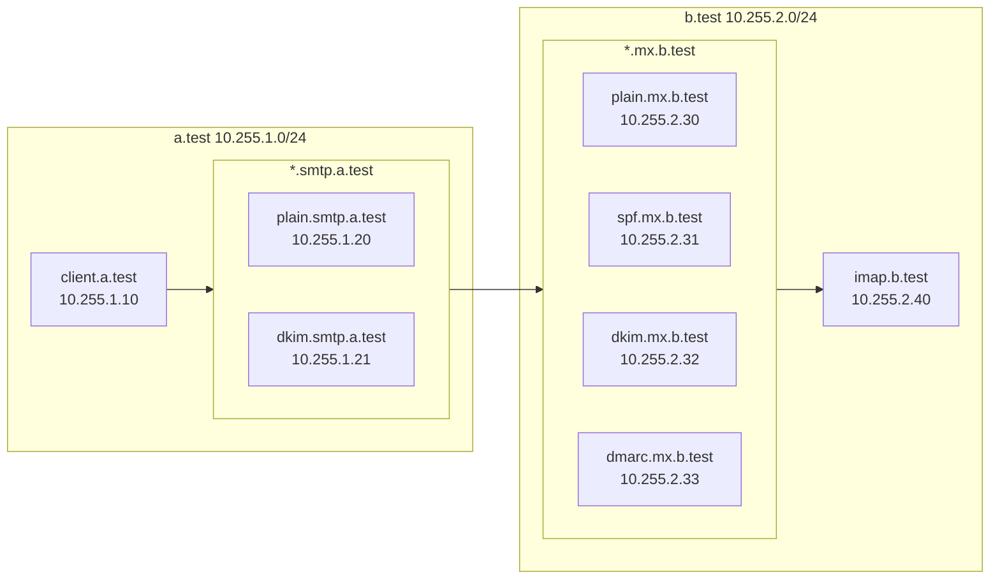

```mermaid
graph LR
    a-client[client.a.test<br>10.255.1.10]
    a-smtp-plain[plain.smtp.a.test<br>10.255.1.20]
    a-smtp-dkim[dkim.smtp.a.test<br>10.255.1.21]

    b-mx-plain[plain.mx.b.test<br>10.255.2.30]
    b-mx-spf[spf.mx.b.test<br>10.255.2.31]
    b-mx-dkim[dkim.mx.b.test<br>10.255.2.32]
    b-mx-dmarc[dmarc.mx.b.test<br>10.255.2.33]
    b-imap[imap.b.test<br>10.255.2.40]

    a-client --> a-smtp
    a-smtp   --> b-mx
    b-mx     --> b-imap

    subgraph a[a.test 10.255.1.0/24]
        a-client
        a-smtp
    end

    subgraph a-smtp[*.smtp.a.test]
        direction LR
        a-smtp-plain
        a-smtp-dkim
    end

    subgraph b[b.test 10.255.2.0/24]
        b-mx
        b-imap
    end

    subgraph b-mx[*.mx.b.test]
        direction LR
        b-mx-plain
        b-mx-spf
        b-mx-dkim
        b-mx-dmarc
    end
```
